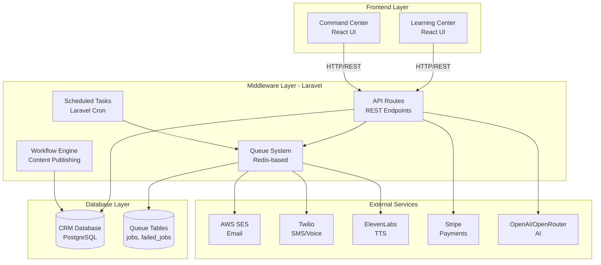
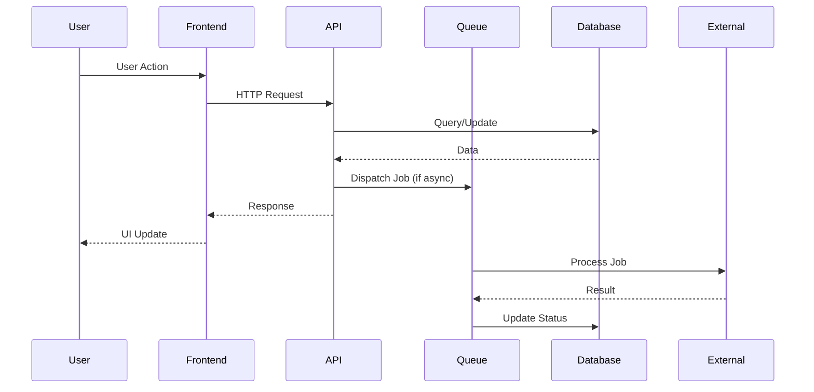
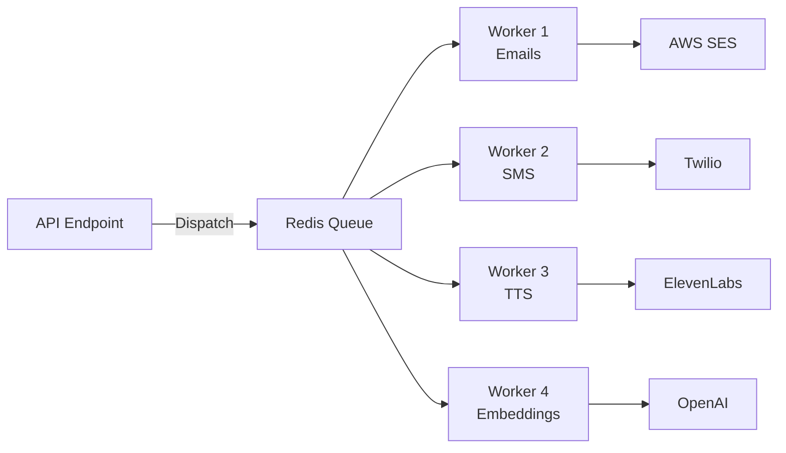

# FIBONACCO OPERATIONS PLATFORM
## Architecture & Platform Design Document

**Version:** 1.0  
**Date:** December 2024  
**Status:** Reference Architecture

---

# TABLE OF CONTENTS

1. [Executive Summary](#executive-summary)
2. [System Architecture](#system-architecture)
3. [Laravel Workflow & API Architecture](#laravel-workflow--api-architecture)
4. [Database Architecture](#database-architecture)
5. [Frontend Architecture](#frontend-architecture)
6. [External Service Integrations](#external-service-integrations)
7. [Platform Design Standards](#platform-design-standards)

---

# EXECUTIVE SUMMARY

## Platform Overview

The Fibonacco Operations Platform is a comprehensive business operations system consisting of four primary components:

1. **Learning Center** - Landing page CMS and frontend UI for customer-facing content
2. **Command Center** - Primary business owner dashboard and UI
3. **CRM** - Database/data layer managing customer relationships, conversations, and analytics
4. **Inbound/Outbound Middleware** - Laravel-based API and workflow management layer

The **AI Component** is integrated into the Command Center UI, with workflows managed in the middleware layer.

## Technology Stack

| Component | Technology |
|-----------|-----------|
| **Backend Framework** | Laravel 11 + PHP 8.3 |
| **Workflow Engine** | Laravel Queues + Scheduled Tasks |
| **API Layer** | Laravel REST API (Sanctum authentication) |
| **Frontend** | React + TypeScript + Vite |
| **Routing** | React Router v7 |
| **Database** | PostgreSQL (RDS Aurora) with pgvector |
| **Cache/Queue** | Redis (ElastiCache) |
| **Hosting** | AWS (ECS Fargate, S3, CloudFront) |
| **Email** | AWS SES |
| **SMS/Voice** | Twilio |
| **TTS** | ElevenLabs |
| **Payments** | Stripe |
| **AI** | OpenAI/OpenRouter |

## Key Architectural Decisions

1. **Laravel Controls All Workflows and APIs**: All business logic, API endpoints, queue processing, and scheduled tasks are managed by Laravel
2. **Separation of Concerns**: Frontend (React) handles UI/UX, backend (Laravel) handles all business logic and data operations
3. **Queue-Based Processing**: Heavy operations (email sending, SMS, TTS generation, embeddings) are processed asynchronously via Laravel queues
4. **Database-First Design**: PostgreSQL with pgvector for semantic search and vector operations
5. **API-First Architecture**: Frontend communicates exclusively through REST APIs

---

# SYSTEM ARCHITECTURE

## High-Level Component Diagram



## Data Flow Architecture

### Request Flow



### Queue Processing Flow



---

# LARAVEL WORKFLOW & API ARCHITECTURE

## API Layer

All API routes are defined in `backend/routes/api.php` and prefixed with `/api/v1/`.

### API Endpoint Categories

#### 1. Knowledge/FAQ APIs
- `GET /api/v1/knowledge` - List knowledge base entries
- `POST /api/v1/knowledge` - Create knowledge entry
- `GET /api/v1/knowledge/{id}` - Get knowledge entry
- `PUT /api/v1/knowledge/{id}` - Update knowledge entry
- `DELETE /api/v1/knowledge/{id}` - Delete knowledge entry
- `POST /api/v1/knowledge/{id}/generate-embedding` - Generate embedding
- `POST /api/v1/knowledge/{id}/vote` - Vote on helpfulness
- `GET /api/v1/faq-categories` - List FAQ categories
- `POST /api/v1/faq-categories` - Create FAQ category

#### 2. Campaign APIs
- `GET /api/v1/campaigns` - List campaigns
- `GET /api/v1/campaigns/{slug}` - Get campaign by slug
- `POST /api/v1/campaigns/generate` - Generate campaign
- `GET /api/v1/campaigns/templates` - List campaign templates
- `POST /api/v1/campaigns/suggestions` - Get campaign suggestions
- `POST /api/v1/learning/contact/sales` - Contact sales
- `GET /api/v1/learning/campaigns/{id}/guide` - Get campaign guide

#### 3. CRM APIs

**Customers:**
- `GET /api/v1/customers` - List customers
- `POST /api/v1/customers` - Create customer
- `GET /api/v1/customers/{id}` - Get customer
- `GET /api/v1/customers/slug/{slug}` - Get customer by slug
- `PUT /api/v1/customers/{id}` - Update customer
- `DELETE /api/v1/customers/{id}` - Delete customer
- `PUT /api/v1/customers/{id}/business-context` - Update business context
- `GET /api/v1/customers/{id}/ai-context` - Get AI context

**Conversations:**
- `GET /api/v1/conversations` - List conversations
- `POST /api/v1/conversations` - Create conversation
- `GET /api/v1/conversations/{id}` - Get conversation
- `PUT /api/v1/conversations/{id}` - Update conversation
- `POST /api/v1/conversations/{id}/end` - End conversation
- `POST /api/v1/conversations/{id}/messages` - Add message
- `GET /api/v1/conversations/{id}/messages` - Get messages

**Analytics:**
- `GET /api/v1/crm/dashboard/analytics` - Dashboard analytics
- `GET /api/v1/crm/analytics/interest` - Interest analytics
- `GET /api/v1/crm/analytics/purchases` - Purchase analytics
- `GET /api/v1/crm/analytics/learning` - Learning analytics
- `GET /api/v1/crm/analytics/campaign-performance` - Campaign performance
- `GET /api/v1/crm/customers/{customerId}/engagement-score` - Engagement score
- `GET /api/v1/crm/campaigns/{campaignId}/roi` - Campaign ROI
- `GET /api/v1/crm/customers/{customerId}/predictive-score` - Predictive score

#### 4. Outbound Campaign APIs

**Campaigns:**
- `GET /api/v1/outbound/campaigns` - List campaigns
- `POST /api/v1/outbound/campaigns` - Create campaign
- `GET /api/v1/outbound/campaigns/{id}` - Get campaign
- `PUT /api/v1/outbound/campaigns/{id}` - Update campaign
- `DELETE /api/v1/outbound/campaigns/{id}` - Delete campaign
- `GET /api/v1/outbound/campaigns/{id}/recipients` - Get recipients
- `POST /api/v1/outbound/campaigns/{id}/start` - Start campaign
- `GET /api/v1/outbound/campaigns/{id}/analytics` - Campaign analytics

**Email Campaigns:**
- `GET /api/v1/outbound/email/campaigns` - List email campaigns
- `POST /api/v1/outbound/email/campaigns` - Create email campaign
- `GET /api/v1/outbound/email/templates` - List email templates
- `POST /api/v1/outbound/email/templates` - Create email template

**Phone Campaigns:**
- `GET /api/v1/outbound/phone/campaigns` - List phone campaigns
- `POST /api/v1/outbound/phone/campaigns` - Create phone campaign
- `GET /api/v1/outbound/phone/scripts` - List phone scripts
- `POST /api/v1/outbound/phone/scripts` - Create phone script
- `POST /api/v1/outbound/phone/campaigns/{id}/call-status` - Update call status

**SMS Campaigns:**
- `GET /api/v1/outbound/sms/campaigns` - List SMS campaigns
- `POST /api/v1/outbound/sms/campaigns` - Create SMS campaign
- `GET /api/v1/outbound/sms/templates` - List SMS templates
- `POST /api/v1/outbound/sms/templates` - Create SMS template
- `POST /api/v1/outbound/sms/campaigns/{id}/sms-status` - Update SMS status

#### 5. Content Generation APIs
- `GET /api/v1/content` - List generated content
- `POST /api/v1/content/generate` - Generate content
- `POST /api/v1/content/generate-from-campaign` - Generate from campaign
- `GET /api/v1/content/templates` - List content templates
- `POST /api/v1/content/templates` - Create content template
- `GET /api/v1/content/{id}` - Get content
- `PUT /api/v1/content/{id}` - Update content
- `POST /api/v1/content/{id}/status` - Update content status

#### 6. Ad Generation APIs
- `GET /api/v1/ads` - List ads
- `POST /api/v1/ads/generate-from-campaign` - Generate ad from campaign
- `POST /api/v1/ads/generate-from-content` - Generate ad from content
- `GET /api/v1/ads/templates` - List ad templates
- `POST /api/v1/ads/templates` - Create ad template
- `GET /api/v1/ads/{id}` - Get ad
- `PUT /api/v1/ads/{id}` - Update ad

#### 7. Publishing APIs
- `GET /api/v1/publishing/dashboard` - Publishing dashboard
- `GET /api/v1/publishing/calendar` - Content calendar
- `GET /api/v1/publishing/analytics` - Publishing analytics
- `POST /api/v1/publishing/content/{id}/publish` - Publish content

#### 8. AI/Personality APIs
- `POST /api/v1/ai/chat` - AI chat endpoint
- `POST /api/v1/ai/context` - Get AI context
- `GET /api/v1/ai/models` - List AI models
- `GET /api/v1/personalities` - List AI personalities
- `POST /api/v1/personalities` - Create personality
- `GET /api/v1/personalities/assignments` - List assignments
- `POST /api/v1/personalities/assign` - Assign personality to customer
- `GET /api/v1/personalities/{id}` - Get personality
- `PUT /api/v1/personalities/{id}` - Update personality
- `DELETE /api/v1/personalities/{id}` - Delete personality
- `POST /api/v1/personalities/{id}/generate-response` - Generate response
- `GET /api/v1/personalities/customers/{customerId}/personality` - Get customer personality

#### 9. Other APIs
- Survey APIs (`/api/v1/survey/*`)
- Article APIs (`/api/v1/articles/*`)
- Search APIs (`/api/v1/search/*`)
- Presentation APIs (`/api/v1/presentations/*`)
- Training APIs (`/api/v1/training/*`)
- TTS APIs (`/api/v1/tts/*`)
- Service APIs (`/api/v1/services/*`)
- Order APIs (`/api/v1/orders/*`)
- Stripe Webhook (`/api/stripe/webhook`)

## Queue System

### Queue Architecture

Laravel uses Redis as the queue backend, configured in `backend/config/queue.php`:

- **Default Connection**: `redis`
- **Queue Tables**: `jobs`, `job_batches`, `failed_jobs`
- **Failed Job Driver**: `database-uuids`

### Queue Jobs

All queue jobs are located in `backend/app/Jobs/`:

1. **SendEmailCampaign** (`SendEmailCampaign.php`)
   - Queue: `emails`
   - Purpose: Send email campaign messages via AWS SES
   - Retry: Configurable via queue config

2. **SendSMS** (`SendSMS.php`)
   - Queue: `sms`
   - Purpose: Send SMS messages via Twilio
   - Retry: Configurable via queue config

3. **MakePhoneCall** (`MakePhoneCall.php`)
   - Queue: `calls`
   - Purpose: Make phone calls via Twilio
   - Retry: Configurable via queue config

4. **GenerateTTS** (`GenerateTTS.php`)
   - Queue: `default` or `tts`
   - Purpose: Generate text-to-speech audio via ElevenLabs
   - Retry: Configurable via queue config

5. **GenerateEmbedding** (`GenerateEmbedding.php`)
   - Queue: `default` or `embeddings`
   - Purpose: Generate vector embeddings for knowledge base entries
   - Retry: Configurable via queue config

### Queue Processing

Queue workers run as separate ECS tasks:
- Multiple workers can process different queues simultaneously
- Workers are configured via environment variables
- Failed jobs are stored in `failed_jobs` table
- Job batching is supported for bulk operations

### Queue Configuration

```php
// backend/config/queue.php
'redis' => [
    'driver' => 'redis',
    'connection' => env('REDIS_QUEUE_CONNECTION', 'default'),
    'queue' => env('REDIS_QUEUE', 'default'),
    'retry_after' => (int) env('REDIS_QUEUE_RETRY_AFTER', 90),
    'block_for' => null,
    'after_commit' => false,
],
```

## Scheduled Tasks

Scheduled tasks are defined in `backend/app/Console/Kernel.php`:

### Current Scheduled Commands

1. **Process Embeddings** (`embeddings:process`)
   - Frequency: Every 5 minutes
   - Purpose: Process pending embedding generation jobs
   - Overlap Prevention: Enabled

2. **Cleanup Old Data** (`cleanup:old-data`)
   - Frequency: Daily
   - Purpose: Clean up old activities and logs

3. **Generate Missing Embeddings** (`embeddings:generate-pending`)
   - Frequency: Hourly
   - Purpose: Generate embeddings for entries missing them

### Scheduler Execution

The Laravel scheduler runs via a cron job that executes `php artisan schedule:run` every minute. In AWS, this is handled by:
- ECS scheduled tasks (EventBridge)
- Or a dedicated ECS task running continuously

## Workflow Management

### Content Workflow Tables

**`content_workflow` table** (`2025_12_25_000003_create_content_workflow_tables.php`):
- Tracks content generation and publishing workflow
- Fields: `id`, `tenant_id`, `content_id`, `status`, `scheduled_publish_at`, `workflow_data`
- Status values: `draft`, `review`, `approved`, `scheduled`, `published`, `archived`

**`content_workflow_history` table**:
- Tracks workflow state changes
- Fields: `id`, `workflow_id`, `action`, `from_status`, `to_status`, `performed_by`, `performed_at`, `notes`

### Workflow Status Transitions

```
draft → review → approved → scheduled → published
  ↓       ↓         ↓           ↓
archived archived archived   archived
```

### Scheduled Publishing

Content can be scheduled for publishing via `scheduled_publish_at` field. The scheduler checks for scheduled content and publishes it automatically.

---

# DATABASE ARCHITECTURE

## Database Schema Overview

All migrations are located in `backend/database/migrations/`.

### Core Tables

#### CRM Tables

**`crm_customers`** (`2024_12_01_000008_create_crm_customers_table.php`):
- Primary customer data
- Fields: `id`, `tenant_id`, `name`, `slug`, `email`, `phone`, `business_context`, `metadata`, `created_at`, `updated_at`
- Indexes: `tenant_id`, `slug`, `email`

**`crm_conversations`** (`2024_12_01_000009_create_crm_conversations_table.php`):
- Conversation tracking
- Fields: `id`, `tenant_id`, `customer_id`, `channel`, `status`, `outcome`, `summary`, `followup_scheduled_at`, `metadata`, `created_at`, `updated_at`
- Indexes: `tenant_id`, `customer_id`, `status`

**`crm_conversation_messages`** (`2024_12_01_000010_create_crm_conversation_messages_table.php`):
- Individual messages within conversations
- Fields: `id`, `conversation_id`, `role`, `content`, `metadata`, `created_at`
- Indexes: `conversation_id`, `created_at`

**`crm_customer_faqs`** (`2024_12_01_000012_create_crm_customer_faqs_table.php`):
- Customer-specific FAQs
- Fields: `id`, `tenant_id`, `customer_id`, `question`, `answer`, `source`, `helpful_count`, `not_helpful_count`, `created_at`, `updated_at`
- Indexes: `tenant_id`, `customer_id`

**`crm_pending_questions`** (`2024_12_01_000011_create_crm_pending_questions_table.php`):
- Pending questions from customers
- Fields: `id`, `tenant_id`, `customer_id`, `question`, `context`, `status`, `answered_at`, `created_at`, `updated_at`
- Indexes: `tenant_id`, `customer_id`, `status`

#### Campaign Tables

**`outbound_campaigns`** (`2025_12_25_000002_create_outbound_campaigns_tables.php`):
- Outbound campaign definitions
- Fields: `id`, `tenant_id`, `name`, `type`, `status`, `scheduled_at`, `started_at`, `completed_at`, `config`, `metadata`, `created_at`, `updated_at`
- Status values: `draft`, `scheduled`, `running`, `paused`, `completed`, `cancelled`
- Indexes: `tenant_id`, `type`, `status`, `scheduled_at`

**`outbound_campaign_recipients`**:
- Campaign recipient tracking
- Fields: `id`, `campaign_id`, `customer_id`, `status`, `sent_at`, `delivered_at`, `opened_at`, `clicked_at`, `replied_at`, `metadata`, `created_at`, `updated_at`
- Status values: `pending`, `queued`, `sent`, `delivered`, `opened`, `clicked`, `replied`, `answered`, `voicemail`, `failed`, `bounced`, `unsubscribed`
- Indexes: `campaign_id`, `customer_id`, `status`

#### Knowledge Base Tables

**`knowledge_base`** (`2024_12_01_000002_create_knowledge_base_table.php`):
- Knowledge base entries
- Fields: `id`, `tenant_id`, `title`, `content`, `category`, `subcategory`, `industry_codes`, `embedding_status`, `embedding`, `is_public`, `allowed_agents`, `source`, `source_url`, `validation_status`, `validated_at`, `validated_by`, `usage_count`, `helpful_count`, `not_helpful_count`, `tags`, `metadata`, `created_by`, `created_at`, `updated_at`
- Indexes: `tenant_id`, `category`, `embedding_status`, `validation_status`, `source`

**`faq_categories`** (`2024_12_01_000003_create_faq_categories_table.php`):
- FAQ category hierarchy
- Fields: `id`, `tenant_id`, `name`, `slug`, `parent_id`, `display_order`, `metadata`, `created_at`, `updated_at`
- Indexes: `tenant_id`, `parent_id`, `slug`

#### Content Workflow Tables

**`content_workflow`** (`2025_12_25_000003_create_content_workflow_tables.php`):
- Content generation workflow
- Fields: `id`, `tenant_id`, `content_id`, `content_type`, `status`, `scheduled_publish_at`, `workflow_data`, `created_at`, `updated_at`
- Indexes: `tenant_id`, `content_id`, `status`, `scheduled_publish_at`

**`content_workflow_history`**:
- Workflow history tracking
- Fields: `id`, `workflow_id`, `action`, `from_status`, `to_status`, `performed_by`, `performed_at`, `notes`, `metadata`

#### Ad Tables

**`ads`** (`2025_12_25_000004_create_ads_table.php`):
- Generated ads
- Fields: `id`, `tenant_id`, `name`, `platform`, `ad_type`, `status`, `content`, `targeting`, `budget`, `schedule`, `scheduled_start_at`, `scheduled_end_at`, `metadata`, `created_at`, `updated_at`
- Status values: `draft`, `review`, `approved`, `scheduled`, `active`, `paused`, `archived`
- Indexes: `tenant_id`, `platform`, `status`, `scheduled_start_at`

#### AI Personality Tables

**`ai_personalities`** (`2025_12_25_000005_create_ai_personalities_tables.php`):
- AI personality definitions
- Fields: `id`, `tenant_id`, `name`, `description`, `system_prompt`, `model`, `temperature`, `max_tokens`, `config`, `metadata`, `created_at`, `updated_at`
- Indexes: `tenant_id`

**`ai_personality_assignments`**:
- Personality-to-customer assignments
- Fields: `id`, `personality_id`, `customer_id`, `assigned_at`, `assigned_by`, `metadata`

#### Other Tables

- **`industries`** - Industry definitions
- **`surveys`** - Survey definitions
- **`survey_sections`** - Survey sections
- **`survey_questions`** - Survey questions
- **`presentations`** - Presentation templates
- **`presenters`** - Presenter configurations
- **`services`** - Service catalog
- **`service_categories`** - Service categories
- **`orders`** - Order tracking

### Database Functions

**`create_database_functions.php`** (`2024_12_01_000007_create_database_functions.php`):
- PostgreSQL-specific functions for vector similarity search
- Full-text search functions
- Helper functions for common queries

### Relationships

Key relationships:
- `crm_customers` → `crm_conversations` (one-to-many)
- `crm_conversations` → `crm_conversation_messages` (one-to-many)
- `outbound_campaigns` → `outbound_campaign_recipients` (one-to-many)
- `ai_personalities` → `ai_personality_assignments` (one-to-many)
- `faq_categories` → `faq_categories` (self-referential, parent-child)

### Indexes

All tables include appropriate indexes for:
- Foreign keys
- Frequently queried fields
- Status fields
- Date/time fields for sorting
- Full-text search fields

---

# FRONTEND ARCHITECTURE

## Frontend Structure

The frontend is a React + TypeScript application built with Vite.

### Directory Structure

```
src/
├── pages/              # Page components
│   ├── LearningCenter/ # Learning Center pages
│   ├── CRM/            # CRM pages
│   ├── CommandCenter/  # Command Center pages
│   └── ...
├── components/         # Reusable components
│   ├── LearningCenter/ # Learning Center components
│   └── ...
├── services/           # API service clients
│   ├── learning/       # Learning Center APIs
│   ├── crm/            # CRM APIs
│   ├── command-center/ # Command Center APIs
│   ├── outbound/       # Outbound campaign APIs
│   └── personalities/  # AI personality APIs
├── AppRouter.tsx       # Main routing configuration
└── ...
```

## Routing

Routing is configured in `src/AppRouter.tsx` using React Router v7.

### Route Categories

1. **Learning Center Routes** (`/learning/*`):
   - `/learning` - Index page
   - `/learning/faqs` - FAQ management
   - `/learning/articles` - Article management
   - `/learning/campaigns` - Campaign management
   - `/learning/services` - Service catalog
   - `/learn/:slug` - Campaign landing pages

2. **CRM Routes** (`/crm/*`):
   - `/crm/dashboard` - CRM dashboard
   - `/crm/customers` - Customer list
   - `/crm/customers/:id` - Customer detail
   - `/crm/analytics/*` - Analytics pages

3. **Command Center Routes** (`/command-center`):
   - `/command-center` - Command Center dashboard

4. **AI Personalities Routes** (`/ai-personalities/*`):
   - `/ai-personalities` - Personality dashboard
   - `/ai-personalities/:id` - Personality detail
   - `/ai-personalities/assign` - Assign personality

## API Integration

Frontend API services are located in `src/services/`:

### Service Structure

Each service follows a consistent pattern:
- Centralized HTTP client (`api-client.ts`)
- Service-specific API methods
- Type definitions
- Error handling

### Example: Learning Center API

```typescript
// src/services/learning/api-client.ts
// Centralized HTTP client with authentication

// src/services/learning/knowledge-api.ts
// Knowledge base API methods

// src/services/learning/campaign-api.ts
// Campaign API methods
```

### API Service Categories

1. **Learning Services** (`src/services/learning/`):
   - `knowledge-api.ts` - Knowledge base
   - `campaign-api.ts` - Campaigns
   - `presentation-api.ts` - Presentations
   - `ai-api.ts` - AI chat
   - `tts-api.ts` - Text-to-speech
   - `service-api.ts` - Service catalog
   - `order-api.ts` - Orders

2. **CRM Services** (`src/services/crm/`):
   - `crm-api.ts` - Customer management
   - `analytics-api.ts` - Analytics
   - `dashboard-api.ts` - Dashboard data

3. **Command Center Services** (`src/services/command-center/`):
   - `content-api.ts` - Content generation
   - `ad-api.ts` - Ad generation
   - `publishing-api.ts` - Publishing

4. **Outbound Services** (`src/services/outbound/`):
   - `campaign-api.ts` - Campaign management
   - `email-api.ts` - Email campaigns
   - `sms-api.ts` - SMS campaigns
   - `phone-api.ts` - Phone campaigns

5. **Personality Services** (`src/services/personalities/`):
   - `personality-api.ts` - Personality management
   - `contact-api.ts` - Contact management

---

# EXTERNAL SERVICE INTEGRATIONS

## AWS SES (Email)

- **Purpose**: Send transactional and campaign emails
- **Integration**: Laravel Mail with SES driver
- **Configuration**: `MAIL_MAILER=ses`, `AWS_ACCESS_KEY_ID`, `AWS_SECRET_ACCESS_KEY`
- **Queue Job**: `SendEmailCampaign`

## Twilio (SMS & Voice)

- **Purpose**: Send SMS messages and make phone calls
- **Integration**: Twilio SDK via Laravel services
- **Configuration**: `TWILIO_ACCOUNT_SID`, `TWILIO_AUTH_TOKEN`, `TWILIO_PHONE_NUMBER`
- **Queue Jobs**: `SendSMS`, `MakePhoneCall`

## ElevenLabs (TTS)

- **Purpose**: Generate text-to-speech audio for presentations
- **Integration**: ElevenLabs API via `ElevenLabsService`
- **Configuration**: `ELEVENLABS_API_KEY`
- **Queue Job**: `GenerateTTS`

## Stripe (Payments)

- **Purpose**: Process payments and subscriptions
- **Integration**: Stripe PHP SDK
- **Configuration**: `STRIPE_KEY`, `STRIPE_SECRET`, `STRIPE_WEBHOOK_SECRET`
- **Webhook**: `/api/stripe/webhook`

## OpenAI/OpenRouter (AI)

- **Purpose**: AI chat, embeddings, content generation
- **Integration**: OpenAI SDK and OpenRouter API
- **Configuration**: `OPENAI_API_KEY`, `OPENROUTER_API_KEY`
- **Services**: `OpenAIService`, `OpenRouterService`

---

# PLATFORM DESIGN STANDARDS

## API Design Standards

### RESTful Conventions

- Use HTTP methods appropriately: GET (read), POST (create), PUT (update), DELETE (delete)
- Use plural nouns for resource names: `/api/v1/customers`, `/api/v1/campaigns`
- Use nested resources for relationships: `/api/v1/customers/{id}/conversations`
- Version APIs: All APIs are prefixed with `/api/v1/`

### Response Format

**Success Response:**
```json
{
  "data": { ... },
  "message": "Success message",
  "meta": {
    "pagination": { ... }
  }
}
```

**Error Response:**
```json
{
  "error": {
    "message": "Error message",
    "code": "ERROR_CODE",
    "details": { ... }
  }
}
```

### Authentication

- Use Laravel Sanctum for API authentication
- Token-based authentication
- Tokens passed via `Authorization: Bearer {token}` header

## Queue Patterns

### Job Naming

- Use descriptive class names: `SendEmailCampaign`, `GenerateTTS`
- Follow Laravel conventions: `{Action}{Resource}`

### Queue Assignment

- Assign jobs to specific queues: `emails`, `sms`, `calls`, `tts`, `embeddings`
- Use `onQueue()` method in job constructor

### Retry Logic

- Configure retry attempts in queue config
- Use `tries` property in job class
- Failed jobs stored in `failed_jobs` table

## Database Patterns

### Migration Standards

- Use descriptive migration names: `create_{table}_table`
- Include indexes for foreign keys and frequently queried fields
- Use UUIDs for primary keys where appropriate
- Include `created_at` and `updated_at` timestamps

### Model Relationships

- Define relationships in Eloquent models
- Use appropriate relationship types: `hasMany`, `belongsTo`, `belongsToMany`
- Eager load relationships to avoid N+1 queries

## Frontend Patterns

### Component Structure

- Use functional components with hooks
- Separate concerns: presentation vs. logic
- Use TypeScript for type safety

### State Management

- Use React hooks for local state
- Use context for shared state
- Consider Redux for complex state management (if needed)

### Routing

- Use React Router v7
- Define routes in `AppRouter.tsx`
- Use route parameters for dynamic segments

---

# CONCLUSION

This architecture document serves as the definitive reference for the Fibonacco Operations Platform. All workflows, APIs, and business logic are controlled by Laravel, with React providing the frontend UI layer.

For deployment instructions, see `AWS_IMPLEMENTATION_PLAN.md`.


